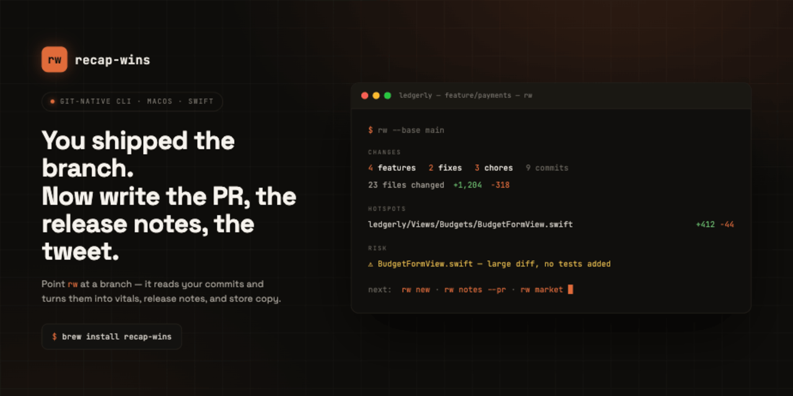

<p align="center">
  <a href="https://novarch.lol/recap-wins"></a>
</p>

# recap-wins

> You shipped the branch. Now write the PR, the release notes, the tweet. `rw` does that part.

[](#install)
[](#install)
[](LICENSE)
[](https://novarch.lol/recap-wins)

You're shipping fast — maybe across more than one product. Your tracker has the
*plan*, but the record of what actually landed drifts: issue titles don't match
what shipped, hotfixes land with no ticket, and a finished branch is a wall of
commits you have to mentally reassemble before you can review it, write the PR,
or announce it.

You already produce the source of truth just by working — the commits and the
diff. `recap-wins` (the `rw` command) reads that and does the reassembly for you.
Point it at a branch and it tells you what you actually shipped — then turns it
into whatever you need to ship it:

```sh
rw                    # what changed on this branch — counts, hotspots, risk flags
rw new                # the list of features you actually added
rw notes --pr         # a PR description, ready to paste
rw market             # launch copy — App Store text, a post, a tweet
```

It runs on your machine and reads from `git`, so it works the same in any repo
regardless of language. The first command (`rw`) is pure git: no network, no API
key. The other three write prose, so they use a model — your own key, or an
agent you already pay for (more on that below).

## What you get

Two kinds of output, depending on the command:

- **The facts** — counts, hotspots, who-touched-what, risk flags. Pure git, no
  AI. Always offline, always free, instant.
- **The writing** — PR descriptions, release notes, marketing copy. This part
  uses a model. You can run it through your own Anthropic or Gemini key, or — if
  you already use an agent like Claude Code — through that, with **no key and no
  per-call cost** (see [Skill mode](#agent-skill-no-api-key)).

So the "what did I change" half costs nothing and never leaves your machine. You
only reach for a key when you want it to do the writing too.

Prefer a page over a terminal? The releases live at
**[novarch.lol/recap-wins](https://novarch.lol/recap-wins)**.

## Install

### Homebrew (recommended)

This repo is its own tap, so one command installs the `rw` binary:

```sh
brew tap yohannescodes/recap-wins https://github.com/yohannescodes/recap-wins
brew install recap-wins
```

Upgrade later with `brew upgrade recap-wins`. (Building the formula compiles from
source via Swift, so the first install takes a minute.)

### From source

Requires Swift 6 and a recent macOS.

```sh
git clone https://github.com/yohannescodes/recap-wins.git
cd recap-wins
swift build -c release
# the binary is at .build/release/rw — symlink or alias it to `rw`:
ln -s "$PWD/.build/release/rw" /usr/local/bin/rw
```

## Commands

Every command compares two points in your repo: your current branch against a
base (`main` by default). Change the base with `--base <ref>` whenever you need
to diff against something else.

| Command | What it does | Needs a key? |
|---|---|---|
| `rw` *(default)* | One screen on what changed — counts, hotspots, risk flags | no |
| `rw new` | The list of features you added, with the chores filtered out | yes* |
| `rw notes <target>` | Writes a note for one target: a PR, App Review, TestFlight/Play, or a store update | yes* |
| `rw market --product <id>` | A pack of launch copy — What's New, promo text, subtitle, a post, a tweet | yes* |
| `rw many` | Just the counts: features / fixes / chores | no |
| `rw blame` | Who changed what | no |
| `rw branch` | Which branches fed into this change | no |
| `rw align --product <id>` | Cross-port parity: matcher, HTML matrix, drafted issues, `--confirm` loop | yes\* |
| `rw help [topic]` | The built-in guide — `concepts`, `notes`, `providers`, `skill`, `config` | — |

<sub>* …or run it key-free through an agent — see [Skill mode](#agent-skill-no-api-key).</sub>

Useful shared flags: `--base <ref>` / `--head <ref>` to pick what you're
comparing, `--repo <path>` to run against another checkout, `--json` for the raw
machine-readable report, and `--html` to render the same view to a
self-contained, offline HTML file (see [HTML output](#html-output)).

New to `rw`? Run **`rw help`** for the in-terminal guide, or read the full
[**User Guide**](GUIDE.md).

```sh
rw --base main             # what changed on this branch vs main
rw many --base develop     # just the feature/fix/chore counts vs develop
rw --json > report.json    # the raw report, for piping into something else
rw new                     # the features you added (needs a key, or skill mode)
rw notes --pr              # a PR description
```

### The commands that write for you (`new`, `notes`, `market`)

These three turn your changes into prose, and that needs a model. You pick where
the model comes from — your own API key, or an agent you already pay for:

| Where the writing comes from | Needs a key? | When to use it |
|---|---|---|
| `anthropic` *(default)* | yes | You have an Anthropic key and just want output, now |
| `gemini` | yes | You'd rather use Google's Gemini (`--provider gemini`) |
| `skill` | **no** | You use an agent like Claude Code — let it do the writing, free |

Set it with `--provider` on the command, or `provider` in your config file (the
flag wins).

**Skill mode — no key, no network.** `rw` does the git work itself and hands the
agent the facts plus a prompt; the agent writes the prose. If you already pay for
Claude through a plan, this is the model work at no extra cost:

```sh
rw new   --provider skill            # emits a JSON envelope for the host agent
rw notes --asc-update --product ledgerly --provider skill
```

**API mode.** Provide a key via the provider's environment variable —
`ANTHROPIC_API_KEY` or `GEMINI_API_KEY` (preferred) — or `api_key` in
`testthese.toml`; the env var wins. Switch backend with `--provider gemini` (or
set `provider` in config); with Gemini selected and the default model left as-is,
`rw` uses a Gemini default model automatically.

```sh
export ANTHROPIC_API_KEY=sk-ant-...
rw new --base main
rw new --provider gemini             # uses GEMINI_API_KEY + a Gemini model
rw notes --pr                              # technical PR description, uncapped
rw notes --asc-update --product ledgerly   # App Store "What's New", in voice, ≤4000
rw notes --gp-update  --product ledgerly --limit 300   # tighter Play note
rw market --product ledgerly               # a full marketing pack in the product's voice
rw market --product ledgerly --pieces tweet,post   # just the social pieces
```

`rw market` produces a **pack** of marketing pieces for the new features —
What's New, App Store promotional text / subtitle, Google Play short description,
a social post, and a tweet — each within its store metadata cap (warns on
overflow, never truncates). Pick specific pieces with `--pieces`.

The point of `--product` is **voice**. If you ship more than one app, each has
its own tone, and copy that sounds like the wrong one is worse than no copy. You
describe each product's voice once in config — *"clear, trustworthy,
private-by-default"* for a finance app; *"calm, reflective"* for a journaling
one — and `market` writes in it, so a Ledgerly update never reads like a DOTS
update. It's distinct from `rw notes --asc-update`, which emits the store-native
release-note block; `market` is the broader announcement set.

Copy [`testthese.toml.example`](testthese.toml.example) to `testthese.toml` to
configure the base ref, model, provider, and product profiles.

`rw notes` takes exactly one target. The user-facing store targets
(`--asc-update`, `--gp-update`, `--what-new`) pull voice and a soft length aim
from the product profile, so pass `--product <id>`. Char caps are hard ceilings:
the tool **warns** if output overflows, it never silently truncates, and
`--limit` only tightens (never loosens past the store ceiling).

The deterministic commands (and `--json` on any command) never need a key and
never touch the network.

## HTML output

Every command takes `--html`, which renders the same report to a single
self-contained, offline HTML file — no CDN, no server, no extra model calls
beyond what the command already made. Useful when terminal scrollback is the
wrong surface for what you produced:

```sh
rw --html                                    # vitals as an HTML page
rw market --product ledgerly --html --open   # store-listing proof sheet, in your browser
rw notes --asc-update --product ledgerly --html
```

The default output path is `.rw/<command>-<range>.html` under the repo (added
to `.gitignore`); pass `--html-out <path>` to override, or `--open` to launch
it in your default browser after writing. `rw market --html` lays out each
piece with a live char meter against its store cap and a copy button — the
preview you'd want before pasting into App Store Connect or Play Console.
`--html` doesn't apply in skill mode (the host agent renders, not `rw`).

## Agent skill (no API key)

`rw` ships as a drop-in **agent skill** ([`skill/`](skill/)): a `SKILL.md` plus a
runner script. Inside a skill-aware agent (Claude Code, Cowork), the agent runs
`rw` for the structured JSON and then writes the prose itself — so the model work
goes through your agent session, with **no API key and no per-call cost**.

```sh
# Install into Claude Code's skills directory
mkdir -p ~/.claude/skills/recap-wins
cp -R skill/ ~/.claude/skills/recap-wins/
```

Then just ask your agent things like *"what did I ship on this branch?"* or
*"write the App Store release notes for this update"* — it invokes the skill,
reads the change report, and writes the answer. The runner finds `rw` on your
PATH (or builds it); set `RW_BIN` to point at a specific binary.

This is the same engine as the CLI — the deterministic core produces the report,
and in skill mode the host agent is the model. See [`skill/SKILL.md`](skill/SKILL.md).

## What `rw` (on its own) tells you

The bare `rw` is the one you'll run most — a one-screen read on the branch
before you write anything:

- How many features, fixes, and chores you introduced
- Files changed, lines added and removed
- Who touched it and which branches fed in
- **Hotspots** — the handful of files that soaked up the most churn
- **Risk flags** — a heads-up when a diff is huge, touches core files, or adds
  code with no tests. A nudge, never a blocker.

## Under the hood

If you want to hack on it: `rw` is two Swift packages. **`RecapCore`** does all
the git work and builds the structured report — no model, no network, ever.
**`SemanticKit`** takes that report and writes the prose through whichever
provider you picked (`anthropic`, `gemini`, or `skill`). The core never depends
on the semantic layer, so the "what changed" half stays offline by design.
Adding a new provider is one method. Tests run against throwaway git repos and a
mock model, so CI needs no key.

## What's coming next

Roadmap, in order:

1. **Localization** — per-locale variants of the user-facing outputs, with
   per-language store caps re-checked (translations routinely overflow a limit
   the English version cleared).
2. **Multi-repo** — an `--all-repos` digest ("what did I touch across every repo
   this week"). Held back as the paid open-core layer.

`rw align` (compare two native ports of the same product and surface parity
gaps) **landed in v0.2.1** — feature-ledger extraction, semantic matcher with
a built-in Apple↔Google equivalence table, drafted issues, the
filterable HTML parity matrix, `--issues` tracker-flavored formatters, and
the `--confirm` loop that promotes confirmed equivalences into the
curated parity map.

Releases are cut via a Homebrew formula built from a source tag.

## Docs

- [**User Guide**](GUIDE.md) — install, the mental model, every command, recipes,
  and troubleshooting. The long-form version of `rw help`.
- [**Changelog**](CHANGELOG.md) — cumulative, newest-first. Each entry links
  to a rendered [release page](docs/changelogs/) written by `rw` itself.
- [**Contributing**](CONTRIBUTING.md) — build/test, house rules, where to file
  issues, what's in and out of scope.
- [**Releasing**](RELEASING.md) — how a new version goes out (maintainers).

## Development

```sh
swift build
swift test
```
